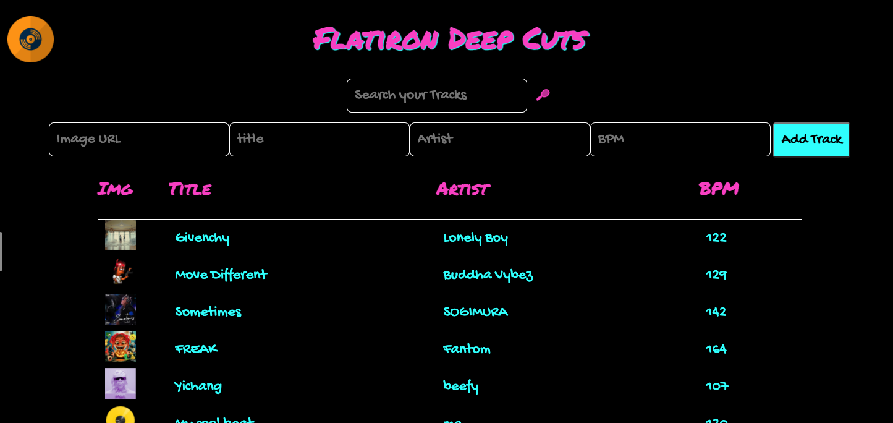

# Flatiron Deep Cuts



As an international DJ and music producer, you need a way to keep track of all the beats you mix together to keep the dancefloor jumping!

## Instructions

For this project, you’ll be building out a React application that displays a
list of song tracks, among other features.

Part of what this code challenge is testing is your ability to follow given
instructions. While you will definitely have a significant amount of freedom in
how you implement the features, be sure to carefully read the directions for
setting up the application.

## Setup

After unbundling the project:

1. Run `npm install` in your terminal.
2. Run `npm run server`. This will run your backend on port `8085`.
3. In a new terminal, run `npm start`.

Make sure to open
[http://localhost:8001/tracks](http://localhost:8001/tracks) in the
browser to verify that your backend is working before you proceed!

If you are unfamiliar with HTML tables, take a look at the
[docs with an example here](https://www.w3schools.com/html/html_tables.asp)

## Endpoints

The base URL for your backend is: `http://localhost:8001`

## Core Deliverables

As a user, I should be able to:

- See a table of all the tracks currently in your library.
- Fill out and submit the form to add a new track. This should add the new track to the table **as well as post the new track to the backend API for persistence**.
- Filter tracks by typing into the search bar. Only tracks that have any field that matches the search term should be shown in the table. Filtering happens 'live' as the search term is typed into the search bar.

### Endpoints for Core Deliverables

#### GET /tracks

Example Response:

```json
[
  {
    "id": 1,
    "title": "Givenchy",
    "artist": "Lonely Boy",
    "BPM": 122,
    "image": "https://cdn5.beatstars.com/eyJidWNrZXQiOiJidHMtY29udGVudCIsImtleSI6InVzZXJzL3Byb2QvMTUxMzAyMi9pbWFnZS9rODlZRzAxclh0VXkvY2djZmd4ZmcuanBnIiwiZWRpdHMiOnsicmVzaXplIjp7ImZpdCI6ImZpbGwiLCJ3aWR0aCI6MjQwLCJoZWlnaHQiOjI0MH19fQ==?t=1638295080242"
},
{
    "id": 2,
    "title": "Move Different",
    "artist": "Buddha Vybez",
    "BPM": 129,
    "image": "https://cdn5.beatstars.com/eyJidWNrZXQiOiJidHMtY29udGVudCIsImtleSI6InVzZXJzL3Byb2QvNDkxNTQ2L2ltYWdlL0NMeFd0R09QaEM0Ty9tb3ZlZGlmZmVyZW50LmpwZyIsImVkaXRzIjp7InJlc2l6ZSI6eyJmaXQiOiJmaWxsIiwid2lkdGgiOjI0MCwiaGVpZ2h0IjoyNDB9fX0=?t=1639408815480"
}
]
```

#### POST `/tracks`

Required Headers:

```js
{
  "Content-Type": "application/json"
}
```

Request Object:

```json
{
  "image": "string",
  "title": "string",
  "artist": "string",
  "BPM": number
}
```

Example Response:

```json
{
    "id": 5,
    "title": "Yichang",
    "artist": "beefy",
    "BPM": 107,
    "image": "https://cdn5.beatstars.com/eyJidWNrZXQiOiJidHMtY29udGVudCIsImtleSI6InVzZXJzL3Byb2QvODI0NDExL2ltYWdlL0EzRkRJQjlHQkJTRC8yMDIyMDEyOC5wbmciLCJlZGl0cyI6eyJyZXNpemUiOnsiZml0IjoiZmlsbCIsIndpZHRoIjoyNDAsImhlaWdodCI6MjQwfX19?t=1643380284285"
}
```

## Advanced Deliverables

These deliverables are not required to pass the code challenge, but if you have
the extra time, or even after the code challenge, they are a great way to
stretch your skills.

> Note: If you are going to attempt these advanced deliverables, please be sure
> to have a working commit with all the Core Deliverables first!

As a user, I should be able to:

- Sort tracks alphabetically by artist or numerically by BPM.
- Delete a track which will remove it from the table and delete it from the backend.

### Endpoints for Advanced Deliverables

#### DELETE /tracks/:id

Example Response:

```json
{}
```
